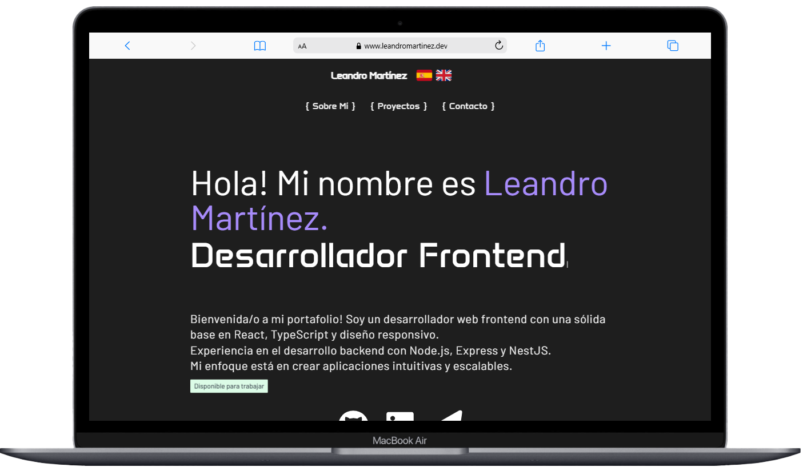
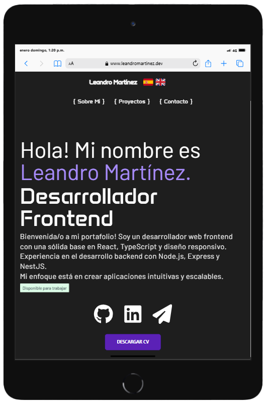
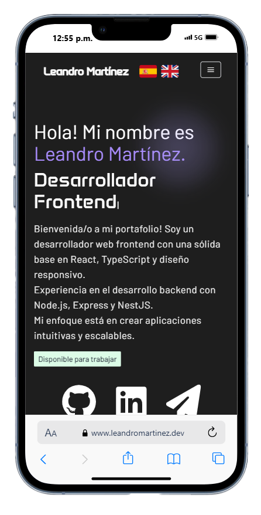

# Portfolio

Web intuitiva con diseño responsivo para mostrar información personal y de contacto, los proyectos desarrollados y la tecnologías que utilizo diariamente.

## Web

[leandromartinez.dev](https://www.leandromartinez.dev/)

## Screenshots

  
  
  

## Features

**Interfaz Multilingüe:** Implementación de una biblioteca que permite a los usuarios alternar entre inglés y español, mejorando la accesibilidad y experiencia del usuario.

**Diseño Responsivo:** Adaptación del diseño para garantizar una visualización óptima en dispositivos móviles, tablets y pantallas de escritorio.

**Sección de Proyectos:** Presentación detallada de los proyectos más destacados, incluyendo descripciones, tecnologías utilizadas y enlaces a los repositorios correspondientes.

**Contacto:** Integración de varios CTA (Call to action) en diferentes secciones de la web, que permite a potenciales empleadores o colaboradores ponerse en contacto de manera directa.

**Animaciones y Transiciones:** Uso de efectos visuales sutiles para mejorar la interacción y navegación dentro del portafolio.

**Optimización de Rendimiento:** Implementación de técnicas para asegurar tiempos de carga rápidos y una experiencia de usuario fluida.

**Integración con Redes Sociales:** Enlaces directos a perfiles profesionales en plataformas como LinkedIn y GitHub, facilitando la conexión con la comunidad.

## Tech Stack

**Frontend:** Css, React, Tailwind, Material Tailwind, AOS, i18Next, TypeWriter

## Contact

**Email:** leandromartinez.dev@gmail.com

**Whatsapp:** [+59895220063](https://api.whatsapp.com/send?phone=59895220063&text=Hola%20Leandro!%20Me%20contacto%20contigo%20porque..)
